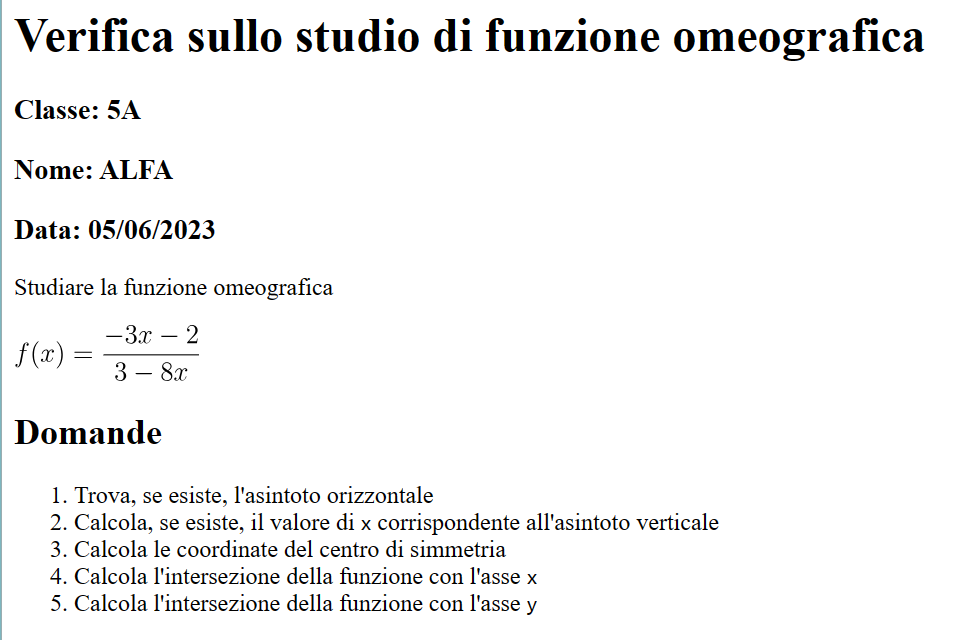

# Generatore di Test a risposta aperta sulla Funzione Omeografica
## Progetto per docenti di matematica delle scuole secondarie superiori

### Introduzione
Questa libreria permette di generare un test di verifica a risposta aperta sulla Funzione Omeografica (in seguito FO) 

=\frac{ax&plus;b}{cx&plus;d})

con coefficienti [a,b,c,d] (random interi compresi in un intervallo tra due estremi inclusi) che variano per ogni alunno 
di una data classe. 

La FO e' una funzione razionale fratta, trattata qui a coefficienti interi, che si presta molto bene allo studio di 
funzione, previsto dalle Indicazioni Nazionali in tutte le scuole secondarie superiori italiane.
Permette di verificare le competenze dell'alunno nell'affrontare i seguenti argomenti:
- dominio di una funzione
- intersezioni con gli assi
- simmetrie
- asintoti
- limiti

### Template 
Il testo del test di verifica a risposta aperta, uguale per tutti gli studenti, e' il seguente:

1. Trova, se esiste, l'asintoto orizzontale

1. Calcola, se esiste, il valore di `x` corrispondente all'asintoto verticale

1. Calcola le coordinate del centro di simmetria

1. Calcola l'intersezione della funzione con l'asse `x`

1. Calcola l'intersezione della funzione con l'asse `y`

Tutte le domande proposte possono essere risposte a partire dal valore dei coefficienti [a, b, c, d] generati per ogni alunno.
Le risposte corrette possono essere valutate calcolando i corrispondenti risultati:
1. y = a/c
2. x = -d/c
3. C = (-d/c, a/c)
4. x = -b/a
5. y = b/d

Le domande proposte possono essere modificate direttamente dall'utente nel file 'templates\test.md'.

### Cosa serve per usare la libreria 
#### Dati in input
Per utilizzare la libreria e' necessario:
1. decidere gli estremi dell'intervallo [e_min, e_max] a cui appartengono i coefficienti a, b, c, d. Il dominio da inserire deve 
essere un intervallo di interi, gli estremi verranno considerati inclusi

2. avere a disposizione un file <classe>.xlsx o <classe>.xls con una colonna, diversa dalla prima, che ha nella cella della prima riga la voce "COGNOME" 
scritta in maiuscolo, e nelle righe successive della stessa colonna i cognomi degli alunni della classe per cui generare
e stampare i test. Riportiamo un esempio di compilazione del file:

3. avere a disposizione il percorso assoluto, all'interno del dispositivo in uso, in cui e' salvato il file <classe>.xlsx 
o <classe>.xls del punto 2

4. facoltativo: avere a disposizione il percorso assoluto, all'interno del dispositivo in uso, in cui salvare i test di 
verifica generati in output per la classe scelta

#### Prerequisiti di configurazione
- Avere una Common Line Interface (CLI) nel dispositivo in uso.
- Avere Python installato nel dispositivo in uso. La libreria e' stata testata per la versione di Python 3.9.13. 

Librerie aggiuntive necessarie (che si possono leggere nei file [requirements_base.txt](https://github.com/pierpaolichiara/funzione_omeografica_test/blob/main/requirements-base.txt) 
e in [requirements-test.txt](https://github.com/pierpaolichiara/funzione_omeografica_test/blob/main/requirements-test.txt)) 
vengono installate automaticamente, se necessario, una volta lanciato il file principale main.py come vedremo nella sezione successiva.

#### Installazione e utilizzo
Per poter usare la libreria e' necessario aprire una CLI e, da linea di comando
5. clonare il repository https://github.com/pierpaolichiara/funzione_omeografica_test con il seguente comando:

`git clone https://github.com/pierpaolichiara/funzione_omeografica_test`

6. aprire la cartella 'funzione_omeografica_test' che e' stata scaricata con il comando 

`cd funzione_omeografica_test`

7. installare la libreria 

`pip install .`

8. lanciare il file main.py come segue

`python funzione_omeografica_test\main.py --estremi_dominio=(e_min,e_max) --elenco_alunni=<classe.xlsx>`
   
oppure

`genera_test --estremi_dominio=(e_min,e_max) --elenco_alunni=<classe.xlsx>`

dove sostituire 
- a `e_min` ed `e_max` gli estremi scelti nel punto 1 
- a `<classe.xlsx>` il percorso assoluto del file excel (o relativo se nella cartella corrente), estensione compresa xls o xlsx, con l'elenco degli alunni del punto 2
- (facoltativo) si puo' specificare, volendo, la cartella (percorso assoluto) in cui si vuole vengano salvati i test generati. 
Per farlo bisogna aggiungere al comando scelto nel punto 8 quanto segue:

` --cartella_output=<percorso_cartella_output>`

e sostituire a `<percorso_cartella_output>` il percorso assoluto della cartella di output desiderata individuato 
nel punto 4.

### Esempio
Consideriamo questi dati come esempio di utilizzo della libreria:

`(e_min, e_max)` = `(-9,9)`

<classe.xlsx> = `CLASSE_5A.xlsx`

percorso file CLASSE_5A = esempio_input\CLASSE_5A

Dunque vogliamo generare test di verifica sulla FO, con coefficienti [a,b,c,d] generati automaticamente dal programma, 
scelti all'interno dell'intervallo (-9,9)  estremi inclusi, per la classe 5A il cui elenco degli studenti e'presente nel 
file indicato, di cui riportiamo le prime due colonne

Per stampare in .html i test a risposta aperta sulla FO con i dati di questo esempio come input: 
- Scaricare la libreria
- Aprire un terminale e collocarsi nella cartella dove e' stata scaricata la libreria
- Da linea di comando lanciare il modulo 'main' come segue:

`python funzione_omeografica_test\main.py --estremi_dominio=(-9,9) --elenco_alunni=esempio_input\CLASSE_5A.xlsx`

oppure

`genera_test --estremi_dominio=(-9,9) --elenco_alunni=esempio_input\CLASSE_5A.xlsx`

  E' anche possibile, e facoltativo, indicare il percorso di una cartella di output dove si vuole che vengano salvati i test generati,
  sostituendo al comando precedente uno dei seguenti:

`python funzione_omeografica_test\main.py --estremi_dominio=(-9,9) --elenco_alunni=esempio_input\CLASSE_5A.xlsx 
--cartell_output=<percorso_cartella_output>`

  oppure

`genera_test --estremi_dominio=(-9,9) --elenco_alunni=esempio_input\CLASSE_5A.xlsx --cartell_output=<percorso_cartella_output>`

- i test stampati in .html sono disponibili nella sottocartella 'funzione_omeografica_test/output', 
o nella cartella indicata dall'utente al punto precedente, denominati con il cognome dell'alunno nel seguente modo:
`test_<COGNOME>.html`,
ad esempio test_ALFA.html, test_BETA.html... 
Riportiamo un esempio di test di verifica stampato:

## Struttura della libreria 'funzione_omeografica_test'
All'interno del progetto 'funzione_omeografica_test' scaricato, disponibile nel repository indicato al punto 5, troviamo alcuni
file e sottocartelle. Elenchiamo quelli di interesse per l'utente:

a. la cartella [`funzione_omeografica_test`](https://github.com/pierpaolichiara/funzione_omeografica_test/tree/main/funzione_omeografica_test): ne approfondiamo il contenuto nel successivo paragrafo

b. la cartella [`esempio_input`](https://github.com/pierpaolichiara/funzione_omeografica_test/tree/main/esempio_input): contiene un file excel di esempio formattato e scritto in modo corretto con una lista di cognomi di prova

c. la cartella [`templates`](https://github.com/pierpaolichiara/funzione_omeografica_test/tree/main/templates): contiene il template 
   con il testo della verifica sulla funzione omeografica, modificabile dall'utente

d. il file [README.md](https://github.com/pierpaolichiara/funzione_omeografica_test/blob/main/README.md): questo file di testo che stai leggendo con spiegazione della libreria e indicazioni di installazione e utilizzo

Approfondiamo ora i contenuti della cartella della cartella nel punto a, `funzione_omeografica_test`. Troviamo disponibili:

a1.[`main.py`](https://github.com/pierpaolichiara/funzione_omeografica_test/blob/main/funzione_omeografica_test/main.py):
   e' il file da lanciare per avviare la procedura di generazione dei test. Assegna i dati forniti in input dall'utente a
delle variabili Python, utilizzate come argomento delle altre funzioni della libreria che vengono richiamate in questo file per generare i test.

a2.[`parse_student_list`](https://github.com/pierpaolichiara/funzione_omeografica_test/blob/main/funzione_omeografica_test/parse_student_list.py): 
e' il file che permette di leggere un file excel impostato come da indicazioni ed estrarne una lista di cognomi.

a3.[`generate_abcd_omeo`](https://github.com/pierpaolichiara/funzione_omeografica_test/blob/main/funzione_omeografica_test/generate_abcd_omeo.py):
e' un modulo che permette di generare una quaterna di coefficienti che rispettano le due C.N.S. per dare origine a una funzione omeografica propria.
Contiene tre funzioni:

    -   

##Verificare corretto funzionamento del codice

Per assicurarsi che il codice funzioni correttamente si possono compilare dei test forniti scaricando il repository,
posizionandosi da linea di comando, nella sottocartella "funzione_omeografica_test\funzione_omeografica_test\test" e poi 
lanciando il comando

`pytest`

In questo modo tutti i test presenti nella cartella [test](https://github.com/pierpaolichiara/funzione_omeografica_test/tree/main/funzione_omeografica_test/test)
il cui nome file inizia con "test_"
##