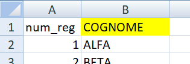

# Generatore di Test a risposta aperta sulla Funzione Omeografica
## Progetto per docenti di matematica delle scuole secondarie superiori

### Introduzione
**SCOPO**: Questa libreria permette di **generare un test di verifica a risposta aperta sulla Funzione Omeografica** (in seguito FO)

=\frac{ax&plus;b}{cx&plus;d})

**i cui coefficienti [a,b,c,d]** (random interi compresi in un intervallo tra due estremi inclusi) **che variano per ogni alunno 
di una data classe**. 

La FO e' una **funzione razionale fratta**, trattata qui a **coefficienti interi**, che si presta molto bene allo studio di 
funzione, previsto dalle Indicazioni Nazionali in tutte le scuole secondarie superiori italiane.
Permette di verificare le competenze dell'alunno nell'affrontare i seguenti argomenti:
- dominio di una funzione
- intersezioni con gli assi
- simmetrie
- asintoti
- limiti

### Template 
Il testo del test di verifica a risposta aperta, uguale per tutti gli studenti, e' il seguente:

1. Trova, se esiste, l'asintoto orizzontale

1. Calcola, se esiste, il valore di `x` corrispondente all'asintoto verticale

1. Calcola le coordinate del centro di simmetria

1. Calcola l'intersezione della funzione con l'asse `x`

1. Calcola l'intersezione della funzione con l'asse `y`

Tutte le domande proposte possono essere risposte a partire dal valore dei coefficienti [a, b, c, d] generati per ogni alunno.
Le risposte corrette possono essere valutate calcolando i corrispondenti risultati:
1. y = a/c
2. x = -d/c
3. C = (-d/c, a/c)
4. x = -b/a
5. y = b/d

Le domande proposte possono essere modificate direttamente dall'utente nel file 'template_content_string.py' visionabile [qua](https://github.com/pierpaolichiara/funzione_omeografica_test/blob/main/funzione_omeografica_test/template_content_string.py).

### Cosa serve per usare la libreria 
#### Dati in input
Per utilizzare la libreria e' necessario:
1. decidere gli **estremi dell'intervallo [e_min, e_max]** a cui appartengono i coefficienti a, b, c, d della FO. Il dominio da inserire deve 
essere un intervallo di interi, gli estremi verranno considerati inclusi

2. avere a disposizione un **file <classe>.xlsx o <classe>.xls** con una colonna, diversa dalla prima, che ha nella cella 
della prima riga (in un foglio di calcolo la cella e' la B1) la voce "**COGNOME**" scritta in maiuscolo, e nelle righe 
successive della stessa colonna i cognomi degli alunni della classe per cui generare e stampare i test. 
Riportiamo un esempio di compilazione del file:

Nel caso in cui nella stessa classe si dovessero avere piu' alunni con lo stesso cognome, si puo' ovviare inserendo dopo
il cognome, nella stessa cella, l'iniziale del nome degli alunni.

3. avere a disposizione il **percorso assoluto**, all'interno del dispositivo in uso, in cui e' salvato il file <classe>.xlsx 
o <classe>.xls del punto 2

4. facoltativo: avere a disposizione il percorso assoluto, all'interno del dispositivo in uso, in cui salvare i test di 
verifica generati in output per la classe scelta

#### Prerequisiti di configurazione
- Avere una **Common Line Interface (CLI)** nel dispositivo in uso
- avere **Python** installato nel dispositivo in uso 
- avere **Git** installato nel dispositivo in uso

Librerie aggiuntive necessarie (che si possono leggere nei file [requirements_base.txt](https://github.com/pierpaolichiara/funzione_omeografica_test/blob/main/requirements-base.txt) 
e in [requirements-test.txt](https://github.com/pierpaolichiara/funzione_omeografica_test/blob/main/requirements-test.txt)) 
vengono installate automaticamente, se necessario, una volta lanciato il file principale main.py come vedremo nella sezione successiva.

La libreria e' stata testata 
- per la versione di Python 3.9.13
- usando come CLI il 'Prompt dei comandi' del Sistema Operativo Windows 10 PRO, versione 22H2
  (libreria pytest, versione 7.1.2; libreria hypothesis, versione 6.70.0)

#### Installazione e utilizzo
Per poter usare la libreria e' necessario aprire una CLI e, da linea di comando,

5. clonare il repository **https://github.com/pierpaolichiara/funzione_omeografica_test** con il seguente comando:

`git clone https://github.com/pierpaolichiara/funzione_omeografica_test`

6. aprire la cartella 'funzione_omeografica_test' che e' stata scaricata con il comando 

`cd funzione_omeografica_test`

7. installare la libreria 

`pip install .`

8. lanciare il file main.py come segue

`genera_test --estremi_dominio=(e_min,e_max) --elenco_alunni=<classe.xlsx>`

dove sostituire 
- a `e_min` ed `e_max` gli estremi scelti nel punto 1 
- a `<classe.xlsx>` il percorso assoluto del file excel (o relativo se nella cartella corrente), estensione compresa xls o xlsx, con l'elenco degli alunni del punto 2
- (facoltativo) si puo' specificare, volendo, la cartella in cui si vuole vengano salvati i test generati. 
Per farlo bisogna aggiungere al comando precedente quanto segue:

` --cartella_output=<percorso_cartella_output>`

e sostituire a `<percorso_cartella_output>`, o il percorso assoluto della cartella di output desiderata individuato nel 
punto 4, o il nome desiderato per la cartella di output, che verra' creata all'interno della cartella 'funzione_omeografica_test'
del punto 6. In ogni caso, una volta lanciato il main.py, la cartella di salvataggio degli output verra' comunicata da CLI
(se l'utente riscontra problemi di riconoscimento del percorso assoluto, puo' provare a inserirlo tra " "). 
Aprendo tale cartella l'utente trovera' stampati i test in output come .html, cosi'denominati: **test_COGNOME.html**.

9. Qualora il comando del punto 8 non dovesse funzionare, l'installazione della libreria non dovesse andare a buon fine o 
se non si vuole installare la libreria (punto 7), si possono comunque generare i test di verifica sulla FO 
procedendo dopo il punto 6 con l'esecuzione del seguente comando:

`python funzione_omeografica_test\main.py --estremi_dominio=(e_min,e_max) --elenco_alunni=<classe.xlsx>`

per cui valgono tutte le sostituzioni e aggiunte indicate nel punto 8.

### Esempio
Consideriamo questi dati come esempio di utilizzo della libreria:

`(e_min, e_max)` = `(-9,9)`

<classe.xlsx> = `CLASSE_5A.xlsx`

percorso file CLASSE_5A = `esempio_input\CLASSE_5A`

Dunque vogliamo generare test di verifica sulla FO, con coefficienti [a,b,c,d] generati automaticamente dal programma, 
scelti all'interno dell'intervallo (-9,9)  estremi inclusi, per la classe 5A il cui elenco degli studenti e' presente nel 
file indicato, di cui riportiamo le prime due colonne

Per stampare in .html i test a risposta aperta sulla FO con i dati di questo esempio come input: 
- Scaricare la libreria
- Aprire un terminale e collocarsi nella cartella dove e' stata scaricata la libreria
- Da linea di comando lanciare il modulo 'main' come segue:

`genera_test --estremi_dominio=(-9,9) --elenco_alunni=esempio_input\CLASSE_5A.xlsx  --id_classe=5A`

(se non funziona, o se siamo nel caso  del punto 9, utilizzare il comando:

`python funzione_omeografica_test\main.py --estremi_dominio=(e_min,e_max) --elenco_alunni=<classe.xlsx>`   )

9. E' anche possibile, e facoltativo, indicare il percorso di una cartella di output dove si vuole che vengano salvati i test generati,
  sostituendo al comando precedente il seguente:

`genera_test --estremi_dominio=(-9,9) --elenco_alunni=esempio_input\CLASSE_5A.xlsx --cartella_output=<percorso_cartella_output>`

(se non funziona, o se siamo nel caso  del punto 9, utilizzare il comando:

`python funzione_omeografica_test\main.py --estremi_dominio=(e_min,e_max) --elenco_alunni=<classe.xlsx>  --cartella_output=<percorso_cartella_output>`   )

- i test stampati in .html sono disponibili nella sottocartella 'funzione_omeografica_test/output', 
o nella cartella indicata dall'utente al punto precedente, riportata nella CLI, denominati con il cognome dell'alunno nel seguente modo:
*test_<COGNOME>.html* , ad esempio "test_ALFA.html", "test_BETA.html"...

**N.B.**: ogni volta che si esegue il programma come da punto 8, utilizzando come input un determinato file excel con i cognomi di 
una classe, per ogni alunno si ottengono ogni volta gli stessi coefficienti, in modo che se l'utente fosse costretto a 
chiudere il programma o rilanciarlo per qualche motivo dopo aver magari gia' stampato le verifiche, e'sicuro che i coefficienti di 
ogni alunno non vengono cambiati.

Riportiamo un esempio di test di verifica stampato:

## Funzione_omeografica_test: struttura della libreria 

All'interno del progetto 'funzione_omeografica_test' scaricato, disponibile nel repository indicato al punto 5, troviamo alcuni
file e sottocartelle. Elenchiamo quelli di interesse per l'utente:

**a.** il file [**README.md**](https://github.com/pierpaolichiara/funzione_omeografica_test/blob/main/README.md): questo file di
testo che stai leggendo con spiegazione della libreria e indicazioni di installazione e utilizzo

**b.** la cartella [**funzione_omeografica_test**](https://github.com/pierpaolichiara/funzione_omeografica_test/tree/main/funzione_omeografica_test): ne approfondiamo il contenuto nel successivo paragrafo

**c.** la cartella [**esempio_input**](https://github.com/pierpaolichiara/funzione_omeografica_test/tree/main/esempio_input): 
contiene un file excel di esempio formattato e scritto in modo corretto con una lista di cognomi di prova. Si puo' utilizzare 
come nell'esempio sopra per generare 12 test di prova. 

e altri file e cartelle di settaggio e configurazione che non interessano direttamente l'utente.

Approfondiamo ora i contenuti della cartella nel punto b, [`funzione_omeografica_test`](https://github.com/pierpaolichiara/funzione_omeografica_test/tree/main/funzione_omeografica_test). 

### ## Funzione_omeografica_test: contenuti della libreria 

Troviamo disponibili:

**b1.**[**main.py**](https://github.com/pierpaolichiara/funzione_omeografica_test/blob/main/funzione_omeografica_test/main.py):
e' il file da lanciare per avviare la procedura di generazione dei test. Assegna i dati forniti in input dall'utente a
delle variabili Python, utilizzate come argomento delle altre funzioni della libreria che vengono richiamate in questo file per generare i test.

**b2.** [**get_output_folder_name.py**](https://github.com/pierpaolichiara/funzione_omeografica_test/blob/main/funzione_omeografica_test/get_output_folder_name.py):
crea il nome di una cartella (cartella_output) vuota allo stesso livello del file corrente se l'input non esiste, 
altrimenti lo crea a partire dall'input indicato

**b3.** [**template_content_string.py**](https://github.com/pierpaolichiara/funzione_omeografica_test/blob/main/funzione_omeografica_test/template_content_string.py):
e' il file con il testo della verifica sulla funzione omeografica, modificabile dall'utente

**b4.** [**parse_student_list.py**](https://github.com/pierpaolichiara/funzione_omeografica_test/blob/main/funzione_omeografica_test/parse_student_list.py): 
e' il file che permette di leggere un file excel impostato come da indicazioni ed estrarne una lista di cognomi.questo modulo serve a estrarre i cognomi degli alunni di una classe da un file excel e generare una lista con i cognomi,
da utilizzare nel modulo 'main.py' come variabile della funzione 'generate_tests'.

**b5.**[**generate_abcd_omeo.py**](https://github.com/pierpaolichiara/funzione_omeografica_test/blob/main/funzione_omeografica_test/generate_abcd_omeo.py):
e' un modulo che permette di generare una quaterna di coefficienti che rispettano le due C.N.S. per dare origine a una funzione omeografica propria.
Contiene tre funzioni:

- **parse_function_domain**: riceve una stringa con gli estremi dell'intervallo di interi da considerare e li associa ad una tupla.
    Evita di richiedere gli estremi separatamente e garantisce la definizione del dominio attraverso un unico elemento
    tupla definito all'inizio dell'esecuzione e non modificabile

- **generate_domain**: genera un insieme di numeri interi relativi compresi tra
    e_min(incluso) ed e_max(incluso), ad esclusione al massimo di un numero denominato
    exclude_value

- **generate_abcd_omeo**: Questa funzione genera una lista di 4 coefficienti interi [a, b, c, d] in grado di dare origine a una funzione omeografica propria
    del tipo f(x)=(ax+b)/(cx+d). In particolare i 4 coefficienti:
        - appartengono al dominio di estremi specificati in input, estremi inclusi
        - vengono scelti con la funzione random.choice dal dominio
        - verificano le due condizioni necessarie e sufficienti (C.N.S.) per dare origine a una funzione omeografica propria:
    
            C.N.S.1:  c≠0
    
            C.N.S.2:  a*d-c*b≠0

**b6.** [**generate_test.py**](https://github.com/pierpaolichiara/funzione_omeografica_test/blob/main/funzione_omeografica_test/generate_tests.py):
questo modulo contiene le funzioni necessarie a generare, per ogni cognome di una lista, un testo in cui compaiono la data corrente,
il cognome e dei parametri associati al cognome. Ogni testo viene convertito successivamente in .html per una migliore fruibilita' da parte dell'utente finale.
E' un modulo costituito da piu'funzioni:

-   **replace_placeholder**: legge un template e sostituisce i segnaposti (placeholder <>) con i valori opportuni stringa per stringa,
    riscrivendo il testo del file riga per riga
 
-  **generate_test_from_template**: genera e salva, in una cartella indicata, un testo .html a partire da un template sotto forma di stringa,
    sostituendo a dei segnaposti i valori indicati in input

-   **convert_to_html**: converte un testo da formato .md a formato .html in un nuovo file  

-   **generate_tests**:genera, con un ciclo, un insieme di testi di verifica, uno diverso per ogni studente di una lista, dove
      a cambiare sono il cognome dello studente e i coefficienti che variano all'interno di un dominio indicato

## Verificare il corretto funzionamento del codice

Per assicurarsi che il codice funzioni correttamente si possono compilare dei test forniti scaricando il repository,
posizionandosi da linea di comando, nella sottocartella "funzione_omeografica_test\funzione_omeografica_test\test" e poi 
lanciando il comando

**`pytest`**

In questo modo tutti i test presenti nella cartella [test](https://github.com/pierpaolichiara/funzione_omeografica_test/tree/main/funzione_omeografica_test/test),
il cui nome del file inizia con "test_", verranno eseguiti. Nel caso in cui tutto funziona correttamente dovrebbe comparire una 
linea di testo in verde che comunica che 43 test sono stati superati ("43 passed").

Documentazione piu' dettagliata su cosa testa ogni singolo test svolto e' reperibile all'interno della cartella [test](https://github.com/pierpaolichiara/funzione_omeografica_test/tree/main/funzione_omeografica_test/test).
Qui sono a disposizione gli scripts dei test eseguiti. Aprendo ogni file *.py, sotto la definizione del test, c'e'
una breve descrizione di cosa verifica il test eseguito. 

Per qualsiasi evenienza, l'autore rimane a disposizione all'indirizzo mail **chiara.pierpaoli@studio.unibo.it**. 

##